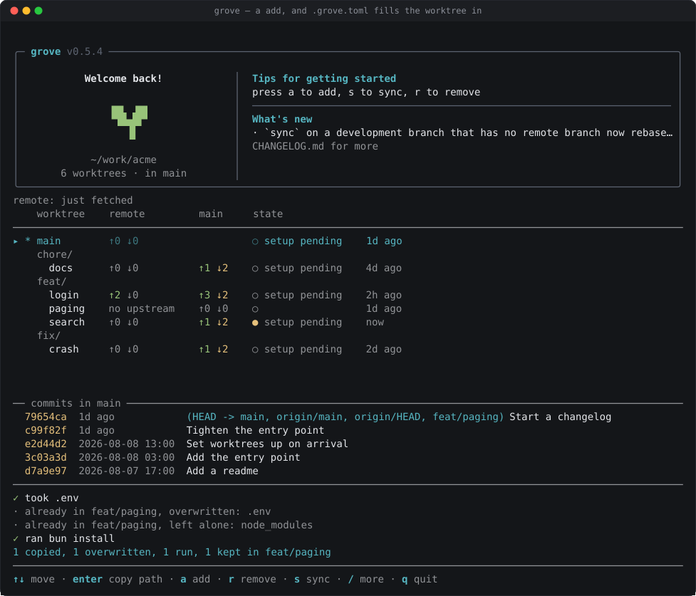

<div align="center">

<picture>
  <source media="(prefers-color-scheme: dark)" srcset="docs/logo-dark.svg">
  
</picture>

# grove

**Worktrees that arrive ready.**

grove is a Git worktree manager with project-defined setup. Clone once, branch freely, and let .grove.toml turn each new worktree into a usable development environment.

[](https://github.com/enginerd-kr/grove/actions/workflows/ci.yml)
[](LICENSE)
[](https://github.com/enginerd-kr/grove/releases)

[Install](#install) · [Quick Start](#quick-start) · [Project Setup](#project-setup-grovetoml) · [Development](#development)

[English](README.md) · [한국어](docs/md/README.ko.md)

</div>

<p align="center">
  
</p>

## What Is This, Really?

Git worktrees let one repository have many working directories. grove turns that into a managed workspace.

- one bare clone stores the repository once
- every branch gets its own predictable directory

In practice, grove is for keeping several branches alive at once: a feature, a hotfix, a review branch, an experiment, and a coding-agent sandbox, each in its own ready-to-run directory.

## Install

```bash
brew install enginerd-kr/tap/grove
# or, with npm (macOS and Linux; needs Node 18+)
npm install -g @enginerd-kr/grove
# or run it without installing
npx @enginerd-kr/grove
```

## Quick Start

```bash
grove clone https://github.com/org/repo.git
cd repo

# If setup was deferred: grove setup main
grove add feat/login
grove add fix/prod-crash
grove
```

grove clone creates a managed repository with a default-branch worktree and applies its setup, asking before unapproved commands in a terminal. grove add creates a branch worktree and applies .grove.toml. Running grove with no arguments opens the interactive manager.

## Stuff You Do With Grove

- **Start a branch without losing your current one.** grove add feat/search creates a real worktree in a predictable path.
- **Branch after you already started typing.** grove add feat/search --take moves your uncommitted changes into the new worktree and leaves the old one clean.
- **Stack one change on another.** grove add feat/step-2 --on feat/step-1 remembers the base, sync rebases through it, grove stack draws the whole chain, and grove propose --stack opens a pull request for every step onto the one below.
- **Review a pull request in a real checkout.** grove pr 42 takes a number, a URL, or a branch name. Sync there receives the PR head without rebasing or pushing. Use `grove sync pr/42 --contribute` to explicitly rebase and push a contribution.
- **Contribute from a fork.** grove clone --upstream keeps your trunk following the original and sends your branches to your fork. Nothing to configure afterwards.
- **Rebase onto a base you pick.** grove rebase lists the candidates, carries your uncommitted changes through, and undoes everything if it conflicts.
- **Give every coding agent its own workspace.** agents/refactor, agents/tests, agents/ui-copy — no second clone.
- **Stop rebuilding the same local setup.** .grove.toml copies .env, links dependency folders, assigns a worktree port and service name, runs the install, opens your editor.
- **See the whole repository at once.** grove shows branches, dirty worktrees, sync drift, recent activity, each branch's pull request with its checks and review, and which worktrees were set up from an older .grove.toml.
- **Discard without regret.** grove reset keeps what it throws away as a commit, and tells you the git stash apply that brings it back.
- **Clear away what is finished.** grove prune removes the worktrees whose branch is gone or already merged, and can ask GitHub about pull requests closed without merging.

## Why Not Just git worktree?

Raw git worktree is powerful, but the day-to-day is still manual:

- choosing where each branch directory belongs
- remembering which folder has uncommitted changes
- keeping every branch synced with its remote and default branch
- copying ignored files like .env, certs, or local config into every new checkout
- deciding whether dependencies should be installed again or shared through symlinks

grove makes those choices repeatable. Branch feat/login becomes feat/login/, the UI shows what changed, and the repository itself describes how a fresh worktree becomes usable.

## Project Setup (.grove.toml)

A repository can carry its own setup recipe. It is tracked and reviewed like any other file, so a fresh clone is set up before anybody explains how.

Add .grove.toml to the default branch:

```toml
[setup]
copy = [".env", "certs", "config/local.json"]
env = { API_HOST = "http://localhost:3000" }
run = ["bun install"]
open = "code ."

[teardown]
run = ["docker compose down"]
```

Every new worktree is then filled in from it:

- **copy** brings files or directories from the default branch's worktree. The trunk's copy wins. A pattern like packages/*/.env covers a package added next week.
- **link** symlinks shared paths like dependency folders, and leaves what the worktree already has. Patterns work here too.
- **env** reaches the setup commands. `PORT` and `COMPOSE_PROJECT_NAME` default to workspace-assigned values; explicit config overrides them.
- **run** runs shell commands in the new worktree, in order. Install dependencies separately in each worktree; share package-manager caches instead of `node_modules`.
- **open** starts your editor.

<p align="center">
  
</p>

See [the workspace development cycle](USAGE.md#workspace-development-cycle) for review updates, setup recipes, runtime variables, and cleanup.

## Layout

One bare clone, and ordinary Git worktrees beside it:

```text
repo/
  .bare/           # Git objects and refs, stored once
  .git             # Points Git commands at .bare
  main/            # Default branch worktree
  feat/login/      # Branch feat/login
  fix/prod-crash/  # Branch fix/prod-crash
  agents/refactor/ # Branch agents/refactor
```

## What It Is Not

- Not a replacement for Git. Every checkout is an ordinary Git worktree.
- Not a package manager. The setup commands are yours: bun install, uv sync, just setup.
- Not a secret manager. .grove.toml is committed and reviewed; keep real secrets out.

## Development

```bash
bun install
bun run grove
bun run grove:dev
bun test
bun run lint
bun run typecheck
bun run build
bun run compile
bun run npm:build
bun run npm:smoke
bun run screenshots
```
