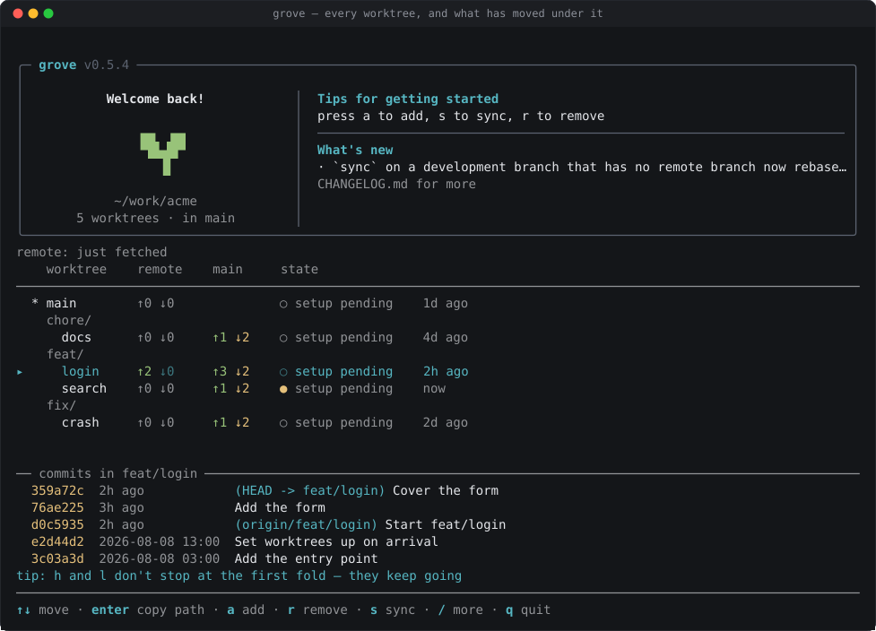
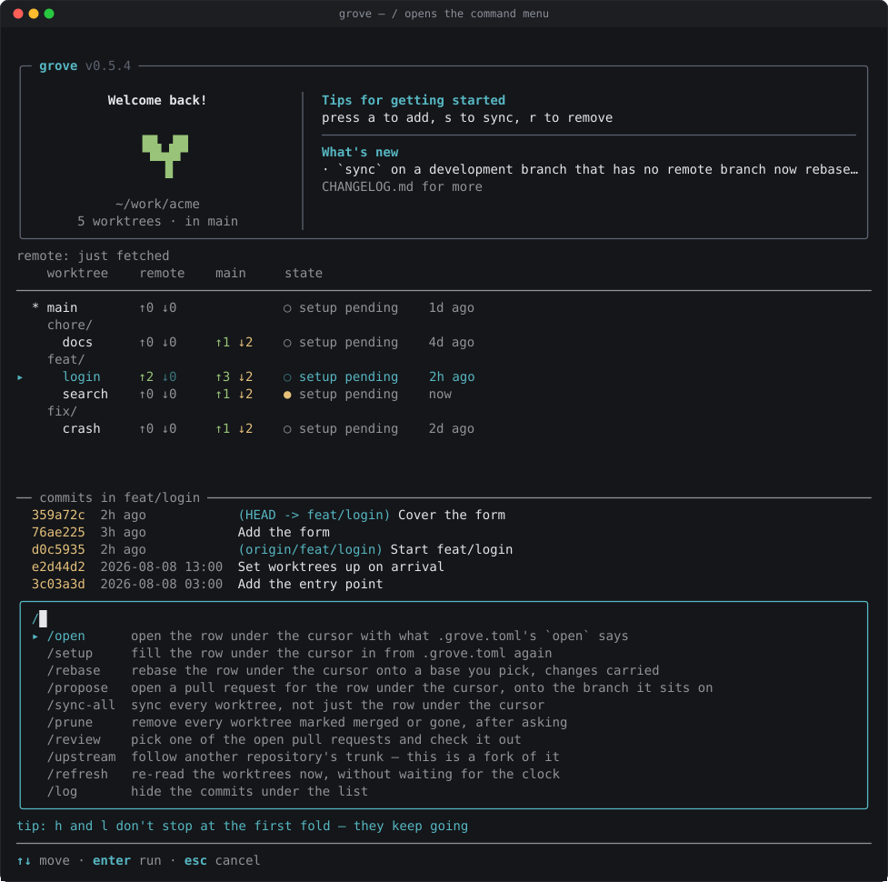

# grove 사용하기

> [English](../../USAGE.md) · [README (한국어)](README.ko.md)

grove는 git 워크트리를 관리합니다. `grove`를 실행하면 대화형 화면이 뜹니다.
워크트리마다 한 줄, 동작마다 키 하나입니다. 모든 동작은 스크립트, 에이전트,
비대화형 셸을 위한 CLI 명령(`grove add`, `grove sync`, ...)으로도 쓸 수
있습니다.

이 가이드는 화면을 먼저 다루고, 그다음 명령을 다룹니다.

- [설치와 첫 실행](#설치와-첫-실행)
- [화면](#화면)
- [자주 하는 작업](#자주-하는-작업)
- [키](#키)
- [디스크 레이아웃](#디스크-레이아웃)
- [워크트리 셋업: .grove.toml](#워크트리-셋업-grovetoml)
- [CLI 레퍼런스](#cli-레퍼런스)
- [스크립트와 에이전트](#스크립트와-에이전트)
- [문제 해결](#문제-해결)

## 설치와 첫 실행

```bash
brew install enginerd-kr/tap/grove
mkdir myapp && cd myapp
grove
```

저장소가 없는 폴더에서 `grove`는 URL을 묻고, 클론한 뒤, 화면을 엽니다. 빈
폴더는 그 자체가 저장소가 됩니다. 비어 있지 않은 폴더에는 하위 폴더에 저장소가
생깁니다.

grove는 기존 `git clone` 안에서도 동작합니다. 새 워크트리는 저장소 옆에
생깁니다(`myapp` 옆에 `myapp-feat-login`). 저장소가 여러 개인 폴더에서는
`grove`가 어느 것인지 묻습니다.

## 화면

<p align="center">
  
</p>

각 줄은 워크트리이고, 브랜치 이름의 폴더별로 묶입니다. `*`는 `grove`를 실행한
워크트리를 표시합니다. `▸`는 커서입니다.

| 열 | 의미 |
| --- | --- |
| origin | 브랜치의 원격 대비 앞선 / 뒤처진 커밋 수 |
| main | 트렁크 대비 앞선 / 뒤처진 커밋 수 |
| state | `●` 커밋하지 않은 변경 있음, `○` 깨끗함, 그 뒤에 마지막 커밋의 시점 |

목록 아래에는 선택한 워크트리에서 변경된 파일과, (`/log`를 켜면) 최근 커밋이
보입니다. 하단 바는 지금 쓸 수 있는 키를 보여 줍니다.

화면은 주기적으로 새로고침됩니다. `/refresh`는 즉시 새로고침합니다.

## 자주 하는 작업

**브랜치 만들기.** `a`, 이름 입력, `enter`. grove가 브랜치와 워크트리를
만들고, `.grove.toml`을 적용하고, 에디터를 열고, `cd <path>`를 클립보드에
복사합니다. 브랜치는 선택한 워크트리에서 갈라집니다. 폴더 줄에서는 이름에
폴더 접두사가 미리 채워집니다.

**워크트리로 이동.** 선택하고 `enter`. 경로가 클립보드에 들어갑니다.

**동기화.** `s`는 fetch하고, 원격에 이어 트렁크 위로 리베이스하고, push합니다.
push가 원격 히스토리를 덮어쓰게 되면 grove가 먼저 묻습니다. 아직 어느 원격에도
없는 브랜치도 묻습니다: `y`를 누르면 push하고 추적합니다. `/sync-all`은 확인
한 번으로 모든 워크트리를 처리하고, 원격에 없는 브랜치만 알려 줍니다.

**제거.** `r`. 프롬프트가 잃게 될 것을 나열합니다. `y`는 워크트리를 제거하고
브랜치는 남깁니다. 폴더 줄에서 `r`은 그 안의 모든 워크트리를 제거합니다.
`/prune`은 `merged` 또는 `gone` 배지가 붙은 워크트리를 한 번에 제거합니다:
프롬프트가 이름을 보여 주고, 브랜치는 남습니다.

**풀 리퀘스트 리뷰.** `/review`, 하나 고르고, `enter`. `pr/<number>`로
체크아웃됩니다. 거기서 push하면 PR이 갱신됩니다. `gh`가 필요합니다.

파괴적인 동작은 모두 먼저 묻습니다. `y`가 확인입니다. 다른 키는 취소합니다.

## 키

| 키 | 동작 |
| --- | --- |
| `↑` `↓` / `k` `j` | 이동 |
| `←` `→` / `h` `l` | 폴더 접기 또는 펼치기; 폴더 밖으로 또는 안으로 |
| `enter` | 선택한 경로 복사 |
| `a` | 선택에서 갈라진 워크트리 추가 |
| `r` | 선택 또는 폴더 전체 제거 |
| `x` | 커밋하지 않은 변경 버리기 (변경이 있을 때만 표시) |
| `s` | 선택 동기화 |
| `/` | 명령 메뉴 |
| `y` / `n` | 확인 / 취소 |
| `q` / `esc` | 종료 |

`/`는 검색 가능한 메뉴를 엽니다. 입력해서 필터하고, `↑` `↓`로 고르고,
`enter`로 실행하고, `esc`로 닫습니다.

<p align="center">
  
</p>

| 명령 | 동작 |
| --- | --- |
| `/open` | 선택을 에디터에서 열기 |
| `/setup` | 선택에 `.grove.toml` 다시 적용 |
| `/sync-all` | 모든 워크트리 동기화 |
| `/prune` | `merged` 또는 `gone` 배지가 붙은 워크트리 제거 |
| `/review` | 열린 풀 리퀘스트 체크아웃 |
| `/refresh` | 워크트리를 지금 다시 읽기 |
| `/log` | 커밋 패널 토글 |

두 가지는 의도적으로 CLI에서만 됩니다: 커밋하지 않은 변경을 새 워크트리로
옮기기(`grove add --take`)와 브랜치를 다른 브랜치 위에 쌓인 것으로
기록하기(`grove add --on`).

## 디스크 레이아웃

```text
myapp/
  .bare/           # git 객체와 ref
  .git             # .bare를 가리키는 파일
  main/            # 기본 브랜치
  feat/login/      # 브랜치 feat/login
  feat/login-api/  # 브랜치 feat/login-api
  pr/42/           # 리뷰용으로 체크아웃한 PR
```

디렉터리 이름 = 브랜치 이름, 슬래시 포함. 각 디렉터리는 평범한 git
워크트리이고, `git`은 거기서 평소처럼 동작합니다. 루트는 절대 워크트리가
아닙니다.

## 워크트리 셋업: .grove.toml

새 워크트리에는 `.env`도 `node_modules`도 없습니다. 기본 브랜치의
`.grove.toml`이 워크트리를 어떻게 채울지 선언합니다. `a` / `grove add`를 할
때마다 적용됩니다.

```toml
[setup]
copy = [".env", "certs", "config/local.json"]
link = ["node_modules"]
env  = { PORT = 3000 }
run  = ["bun install"]
open = "code ."

[teardown]
run = ["docker compose down"]
```

| 키 | 의미 |
| --- | --- |
| `copy` | 트렁크 워크트리에서 복사. 트렁크가 우선하고, 디렉터리는 병합 |
| `link` | 트렁크의 경로로 심볼릭 링크. 이미 있는 항목은 그대로 둠 |
| `env` | `run` 명령의 환경 변수 |
| `run` | 워크트리에서 순서대로 실행하고 끝날 때까지 기다리는 명령 |
| `open` | 에디터 명령. 기다리지 않으며, 터미널이 닫혀도 살아 있음 |
| `[teardown] run` | 워크트리를 제거하기 전에 실행하는 명령 |

규칙:

- 경로는 워크트리 안에 있어야 합니다. 절대 경로, `..`, `.git`, `.bare`는
  파일 전체를 거부합니다.
- 알 수 없는 키는 오류입니다. `cpoy = [".env"]`는 아무 일도 안 하는 대신
  실패합니다.
- 리스트 키는 문자열 하나도 받습니다: `copy = ".env"`.

모든 키는 플랫폼별로 나눌 수 있습니다. 키는 `macos`, `linux`, `windows`이고,
테이블에서 빠진 플랫폼은 거기서 아무것도 받지 않습니다. `env`의 플랫폼 키는
그 플랫폼의 변수를 담고, 공용 변수보다 우선합니다:

```toml
[setup.open]
macos = 'open -a "Visual Studio Code" .'
linux = "code ."

[setup.copy]
macos   = [".env"]
windows = [".env", "local.bat"]

[setup.env]
PORT    = 3000
windows = { SHELL = "pwsh" }

[teardown.run]
macos = ["docker compose down", "colima stop"]
```

### 세 겹의 설정

| 파일 | 범위 |
| --- | --- |
| `~/.config/grove/config.toml` | 내 머신. `open`은 여기에 |
| `.grove.toml` | 프로젝트. 커밋됨 |
| `.grove.local.toml` | 이 체크아웃. gitignore됨 |

이 순서로 적용됩니다. `copy`, `link`, `run`은 겹마다 누적됩니다. `open`과
각 `env` 변수는 마지막에 설정된 값을 씁니다.

### 신뢰

`copy`와 `link`는 즉시 실행됩니다. `run`과 `open`은 승인하기 전까지 실행되지
않습니다. 그렇지 않으면 `git pull`이 임의의 명령을 실어 올 수 있기 때문입니다.

grove는 명령을 보여 주고 묻습니다. `y`가 승인입니다. 화면에서는 `a` 다음에
나오는 프롬프트이고, CLI에서는 터미널이 붙어 있을 때 `grove add`, `grove pr`,
`grove setup`, `grove open` 아래에서 같은 질문이 나옵니다. `--trust`는 이
질문에 미리 답합니다. 파이프, `--headless`, `--json`에서는 아무것도 묻지
않습니다: 명령을 출력하고 건너뜁니다.

승인은 파일의 해시로, bare 저장소의 git config에 저장됩니다(로컬이며 절대
push되지 않음). 파일을 편집하면 승인이 취소됩니다. `config.toml`과 추적되지
않는 `.grove.local.toml`은 승인이 필요 없습니다.

### 셋업 다시 적용하기

`a`는 그 시점의 `.grove.toml`을 적용합니다. 파일이 나중에 바뀌면 워크트리에서
`/setup`을 실행하거나 `grove setup --all`을 실행하세요. 멱등적입니다: `copy`는
트렁크에서 덮어쓰고, `link`는 기존 항목을 그대로 두며, `run`은 여러분의
명령입니다.

`run`, `teardown`, `exec` 명령은 `GROVE_ROOT`, `GROVE_WORKTREE`,
`GROVE_BRANCH`를 받습니다.

## CLI 레퍼런스

모든 명령에 `--help`가 있으며, 파서 자체의 테이블에서 생성됩니다.

```bash
grove clone <url> [-b <branch>]   # 첫 실행 화면; `init`은 별칭
grove add <branch>                # a
grove list                        # 줄들을 텍스트로
grove path [target]               # enter; target 없으면 루트 출력
grove open [target]               # /open
grove setup [target | --all]      # /setup
grove sync [target | --all]       # s, /sync-all
grove pr <number | url | branch>  # /review
grove reset <target>              # x
grove remove <target>             # r
grove prune                       # /prune
grove rename <target> <name>      # 브랜치와 디렉터리를 함께 옮김
grove exec -- <command>           # 모든 워크트리에서 실행
grove doctor                      # 진단
```

`<target>`은 브랜치, 디렉터리, 또는 경로입니다. 기본값은 현재 워크트리입니다.
`-C <path>`는 저장소를 명시적으로 선택합니다.

```bash
cd "$(grove path feat/login)"
```

### add

로컬 브랜치가 있으면 그것을 쓰고, 원격 브랜치가 있으면 추적하고, 아니면 기본
브랜치에서 만듭니다.

| 플래그 | |
| --- | --- |
| `--from <base>` | 대신 `<base>`에서 만들기 |
| `--on <branch>` | `<branch>`에서 만들고 부모로 기록 (스택) |
| `--take` | 현재 워크트리의 커밋하지 않은 변경을 새 워크트리로 옮기기 |
| `--push` | push하고 upstream 설정 |
| `--trust` | `.grove.toml` 명령 승인 |
| `--no-fetch`, `--no-setup` | fetch 건너뛰기 / `.grove.toml` 건너뛰기 |

스택된 브랜치는 부모 위로 리베이스되고, 트렁크 위로는 부모를 거쳐서만
리베이스됩니다. 부모가 자식보다 먼저 동기화되고, 자식을 동기화하면 부모도
동기화됩니다. 기록은 bare 저장소 config의 `branch.<name>`이므로, `git branch
-m`이 함께 옮깁니다.

### sync

fetch한 뒤:

- **기본 브랜치**: fast-forward하거나, 로컬 커밋을 리베이스하고 push.
- **그 외 모든 브랜치**: 원격 위로 리베이스하고, 트렁크 위로 리베이스하고,
  `--force-with-lease`로 push.

변경이 있는 워크트리는 아무것도 실행하기 전에 중단합니다. 충돌한 리베이스는
`--no-abort`가 없으면 abort됩니다. `--no-push`는 결과를 로컬에 둡니다.

아직 원격에 없는 브랜치(`--push` 없이 `grove add`한 경우)는 리베이스된 뒤
종료 코드 4로 보고됩니다: 아무것도 push되지 않았고, 아무것도 거부되지
않았습니다. `--publish`는 origin으로 push하고 추적합니다. `--no-push`는
로컬에 두겠다는 뜻이며, 아무것도 보고하지 않습니다.

화면은 force-push 전과 첫 push 전에 확인합니다. CLI는 둘 다 하지 않습니다.

### remove / prune

`remove`는 `--force`가 없으면 안전하지 않은 워크트리를 거부합니다. 리베이스
중인 워크트리는 무조건 거부합니다. `--delete-branch`는 브랜치를 삭제합니다.
`--no-teardown`은 `[teardown]`을 건너뜁니다.

`prune`은 fetch한 뒤, 브랜치가 원격에서 사라졌거나(`--gone`) 트렁크에
병합된(`--merged`) 워크트리를 제거합니다. 플래그가 없으면 둘 다입니다. `-n`은
제거될 것을 출력만 합니다. 변경이 있거나, 리베이스 중이거나, 잠겼거나, 현재인
워크트리는 건너뛰고 보고합니다.

### reset

`git reset --hard`. `--clean`은 추적되지 않는 파일도 삭제합니다. `--to <ref>`는
다른 ref로 리셋합니다.

### exec

`--` 뒤의 명령을 모든 워크트리에서 셸 한 줄이 아니라 프로세스로 실행합니다.
셸 문법에는 `sh -c`를 쓰세요. `--fail-fast`가 없으면 실패해도 계속합니다.
명령의 stdout만 stdout으로 갑니다.

```bash
grove exec -- bun install
grove exec -- git status --short
grove exec -- sh -c 'echo $GROVE_BRANCH'
```

## 스크립트와 에이전트

- `--json`은 JSON 문서 하나를 stdout에 출력합니다. 사람용 출력은 stderr로
  갑니다.
- `--headless`(또는 TTY가 아닌 경우)는 화면을 끕니다. 명령은 절대 묻지
  않습니다. 실행하거나 종료 코드로 실패합니다.
- `--verbose`는 모든 git 명령을 종료 코드와 소요 시간과 함께 기록합니다.

| 종료 코드 | 의미 |
| --- | --- |
| 0 | 정상 |
| 1 | grove 버그 |
| 2 | 사용법 오류 |
| 3 | 저장소가 아님 |
| 4 | 거부됨 |
| 5 | 리베이스 충돌 |
| 6 | 상태 충돌 (`doctor`가 문제를 찾은 경우도 포함) |
| 7 | git 명령 실패 |
| 8 | 원격 오류 |
| 9 | `[setup]` 명령 실패 (워크트리는 존재함) |
| 10 | `gh`가 없거나 실패 |
| 11 | 하나 이상의 워크트리에서 `exec` 실패 |
| 130 | Ctrl-C |

전형적인 에이전트 루프:

```bash
grove add agents/<task> --trust --json   # 생성; stdout에서 경로 읽기
# ... 워크트리에서 작업 ...
grove sync agents/<task> --publish        # 첫 push까지; 없으면 종료 코드 4
grove remove agents/<task> --delete-branch
```

## 문제 해결

```bash
grove doctor
```

문제와 각각을 고치는 명령을 보고합니다. 아무것도 쓰지 않습니다. 검사 항목:
fetch refspec이 없는 bare 클론, git은 나열하지만 디스크에 없는 워크트리, 남은
디렉터리, 잘못된 곳을 가리키는 루트 `.git`, 깨진 심볼릭 링크. 문제가 있으면
`6`, 경고만 있으면 `0`으로 종료합니다.

버그가 아닌 것:

- **아무것도 설치되지 않았어요.** `run`은 신뢰가 필요합니다: 물어볼 때 `y`로
  답하거나 `--trust`를 넘기세요. 파이프에서는 묻지 않습니다. `copy` / `link`는
  내 브랜치가 아니라 트렁크 워크트리에서 읽습니다.
- **`grove`가 화면 대신 사용법을 출력했어요.** TTY가 없거나 `--headless`입니다.
- **`grove exec`가 내 플래그를 먹었어요.** 명령 앞에 `--`를 넣으세요.
- **`grove <command>`가 저장소 선택을 거부했어요.** 폴더에 저장소가 여러 개
  있습니다. 하나로 `cd`하거나 `-C`를 넘기세요.

## grove가 아닌 것

- git의 대체품이 아닙니다. 모든 워크트리는 평범한 git 워크트리입니다.
- 패키지 관리자가 아닙니다. 셋업 명령은 여러분의 것입니다.
- 비밀 관리자가 아닙니다. `.grove.toml`은 커밋됩니다. 비밀은 로컬 겹에
  두세요.
